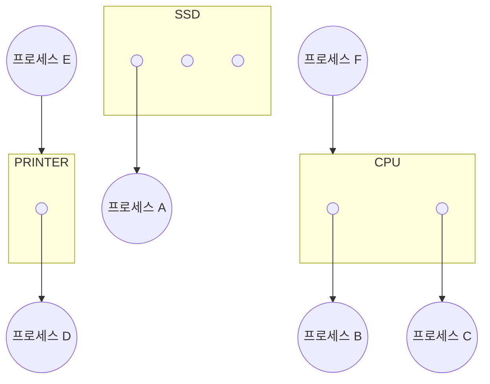
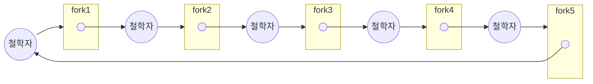

# [혼공단] '혼자 공부하는 컴퓨터 구조 + 운영체제' 5주차

##  Chapter 12. 프로세스 동기화

### 12-1. 동기화란?

#### 동기화의 의미

```
정보 통신 분야에서의 동기화란?
- 작업들 사이의 수행 시기를 맞추는 것
```
- `프로세스 동기화` : 프로세스들 사이의 수행 시기를 맞추는 것

##### 실행 순서 제어를 위한 동기화

##### 상호 배제를 위한 동기화

#### 생산자와 소비자 문제

- `상호 배제 문제`

#### 공유 자원과 임계 구역

- `공유 자원` : 동시에 실행되는 프로세스들 사이에서 공유되는 자원.  (ex. 전역 변수,  파일, I/O Device)

- `임계 구역` : 공유 자원에 접근하는 코드 영역.

* 공유 자원에 둘 이상의 프로세스가 동시에 접근할 경우 문제갸 발생할 수 있으므로 특정 프로세스가 임계 구역에 진입하여 작업 중인 경우, 다른 프로세스는 임계 구역에 접근하면 안된다.

```C
acquire();  // 뮤텍스 락 획득 (= 잠금 설정)
// 임계 구역
release(); // 뮤텍스 락 해제 (= 잠금 해제)
```

### 12-2. 동기화 기법

#### 뮤텍스 락

- 상호 배제 동기화 도구
- 임계 구역에 진입하기 전 `특정 전역 변수(뮤텍스 락)`의 상태를 잠금으로 변경하고 임계 구역에 진입
- 해당 전역 변수의 상태가 잠금인 경우 잠금이 해제될 때까지 다른 프로세스들은 대기
- 이후 임계 구역에 진입한 프로세스가 작업을 끝낸 후 뮤텍스 락의 잠금을 해제

#### 세마포어

- 공유 자원이 여러 개 존재하는 경우 상호 배제 동기화를 위해 사용. (= `카운팅 세마포어` *)
* `이진 세마포어` 의 경우 뮤텍스 락과 비슷함.

- 전역 변수 `S` : 사용 가능한 공유 자원의 개수
- `wait` 함수 : 임계 구역에 들어가도 좋은  기다려야 할지를 알려주는 함수
- `signal` 함수 : `wait` 에 의해 대기 중인 프로세스에게 진입 신호를 주는 함수

```C
wait();
// 임계 구역
signal();
```
- 세마포어를 이용해 프로세스 실행 순서 동기화

|   P1      |   P2      |
|-----------|-----------|
|           |`wait()`     |
|// 임계구역|// 임계구역|
|`signal()`   |           |

#### 모니터

- 공유 자원과 공유 자원에 접근하기 위한 인터페이스를 묶어서 관리
- 프로세스는 반드시 해당 인터페이스를 통해서만 공유 자원에 접근하여야 함
- `모니터` 는 해당 인터페이스에 접근하기 위한 큐를 만들고 모니터 내부에 항상 하나의 프로세스만 들어오도록 하여 상호 배제 동기화 제공

##  Chapter 13. 교착 상태

### 13-1. 교착 상태란

#### 식사하는 철학자 문제

```
1. 동그란 원탁에 다섯명의 철학자가 앉아 있음.
2. 철학자들 앞에는 식사가 있으며, 철학자들 사이 사이에 식사에 필요한 포크가 있음.
3. 식사는 두 개의 포크를 모두 사용해야 먹을 수 있음.
4. 철학자들이 식사하는 순서는 아래와 같음.
    (1) 계속 생각을 하다가 왼쪽 포크가 사용 가능하면 집어든다.
    (2) 계속 생각을 하다가 오른쪽 포크가 사용 가능하면 집어든다.
    (3) 왼쪽과 오른쪽 포크를 모두 집어들면 정해진 시간동안 식사를 한다.
    (4) 식사 시간이 끝나면 오른쪽 포크를 내려놓는다.
    (5) 오른쪽 포크를 내려놓은 뒤 왼쪽 포크를 내려놓는다.
    (6) 다시 1번부터 반복한다.
```

- `교착 상태(Deadlock)`
	- 위의 `식사하는 철학자 문제`에서 모든 철학자가 왼쪽 포크만 집어들 경우, ***모든 철학자가 다른 철학자가 포크를 내려놓을 때까지 기다리는 상황***이 발생
	- 이를 `교착 상태`라고 하며, ***공유 자원을 둘 이상 필요로 하는 프로세스 (혹은 스레드) 가 하나씩의 공유 자원을 선점하고 다른 공유 자원이 사용 가능할 때까지 무한정 기다리는 현상***을 의미

#### 자원 할당 그래프(resource-allocation graph)

- 어떤 프로세스가 어떤 자원을 사용하고 있는지, 혹은 어떤 프로세스가 어떤 자원을 기다리고 있는지 표현하는 그래프
- 작성 규칙
    1. `프로세스`는 `원`으로  `자원의 종류`는 `사각형`으로 표현
	2. 사용할 수 있는 `자원의 개수`는 `자원 사각형 내에 점`으로 표현
    3. 프로세스가 어떤 자원을 할당받아 사용 중이라면 자원에서 프로세스를 향해 화살표를 표시
	4. 프로세스가 어떤 자원을 기다리고 있다면 프로세스에서 자원으로 화살표를 표시

- ex 1.


- ex 2.


#### 교착 상태 발생 조건

##### 상호 배제

- 한 프로세스가 사용하는 자원을 다른 프로세스가 사용할 수 없음

##### 점유와 대기

- 자원을 할당받은 상태에서 다른 자원의 할당을 기다리는 상태

##### 비선점

- 한 프로세스가 점유한 자원을 다른 프로세스가 강제로 빼앗지 못함

##### 원형 대기

- 자원 할당 그래프가 원의 형태로 그려짐

### 13-2. 교착 상태 해결 방법

#### 교착 상태 예방

##### 상호 배제 X

- 모든 자원을 공유가능하게 만든다는 것과 동일한 의미 -> 현실성 X

##### 점유와 대기 X

- 예를 들어, `식사하는 철학자 문제`에서 포크 하나를 들고 다른 포크를 기다리지 못하게 하는 것
- 특정 프로세스에 자원을 모두 할당하거나 아예 할당하지 않는 방식
- ***자원의 활용률이 낮아지는 문제*** 발생 가능
- ***많은 자원을 사용하는 프로세스***가 스케쥴링에서 불리해짐. `기아 현상` 발생 가능

##### 비선점 X

- 모든 자원에 적용하기 어려움.
- 예를 들어, 프린터
    - 한 프로세스의 요청을 출력하는 도중에 다른 프로세스의 작업을 처리하기 어려움

##### 원형 대기 X

- 모든 자원에 번호를 붙이고 반드시 오름차순으로 자원을 할당
- 현실적으로 모든 자원에 번호를 붙이고 관리하는 것은 어렵고 비효율적

#### 교착 상태 회피

- `교착 상태`를 `한정된 자원의 무분별한 할당`으로 발생하는 문제로 간주하고 프로세스에 배분할 수 있는 자원의 양을 고려하여 교착 상태가 발생하지 않을 정도로만 자원을 배분하는 방법

- `안전 상태(safe state)` : 모든 프로세스가 정상적으로 자원을 할당받고 종료될 수 있는 상태 <-> `불안전 상태(unsafe state)`

- `안전 순서열(safe sequence)` : 교착 상태 없이 안전하게 프로세스들에게 자원을 할당할 수 있는 순서. `안전 상태`는 `안전 순서열`이 존재하는 상태

- ex

#### 교착 상태 검출 후 회복

- `교착 상태`의 발생을 인정. 사후 조치를 통해 `교착 상태`를 해결하는 접근법

##### 선점을 통한 회복

- 교착 상태가 해결될 때까지 한 프로세스씩 자원을 몰아주는 방식

##### 프로세스 강제 종료를 통한 회복

- 두 가지로 구분
    - 교착 상태에 놓인 프로세스를 `모두 강제 종료` : 프로세스들이 작업 내역을 잃게 될 가능성 존재
    - 교착 상태가 해결될 때까지 `한 프로세스씩 강제 종료` : 작업 내역을 상실하는 프로세스 숫자를 줄일 수 있으나 교착 상태 확인 과정에서 오버헤드 발생


\* 그 외에 `타조 알고리즘`** 도 존재

** `타조 알고리즘(ostrich alogrithm)` : 교착 상태를 아예 무시. 문제 발생 빈도가 매우 드물거나, 무시해도 될 정도로 심각성이 낮은 경우

---

## 5주차 숙제

### (p. 363) 확인 문제 1번

#### Q 13-1. 뮤텍스 락과 세마포에 대한 설명으로 옳지 않은 것을 고르세요.

1. 뮤텍스 락은 임계 구역을 잠근 뒤 임계 구역에 진입함으로써 상호 배제를 위한 동기화를 이룹니다.
2. 세마포는 공유 자원이 여러 개 있는 상황에서도 이용할 수 있습니다.
3. 세마포를 이용해 프로세스 실행 순서 제어를 위한 동기화도 이룰 수 있습니다.
4. 세마포를 이용하면 반드시 바쁜 대기를 해야 합니다.


#### A. 4

- 반드시 `바쁜 대기`*를 할 필요는 없음. 할당 받을 수 있는 공유 자원이 없는 경우, 프로세스를 대기 상태로 전환할 수도 있다.

*  `바쁜 대기` : 할당 받을 수 있는 공유 자원이 있는지 반복문을 돌면서 계속 확인하는 것.

---

### 추가 숙제

#### Q. 임계 구역 /  상호 배제 구역 정리

#### A. 답안

- `임계 구역` : 동시에 실행되는 두 개 이상의 프로세스가 공유하는 자원은 두 프로세스가 동시에 접근하는 경우가 문제가 발생할 수 있음. 이 때 공유 자원에 접근하는 코드 영역을 `임계 구역(Critical Section)` 이라고 함.
